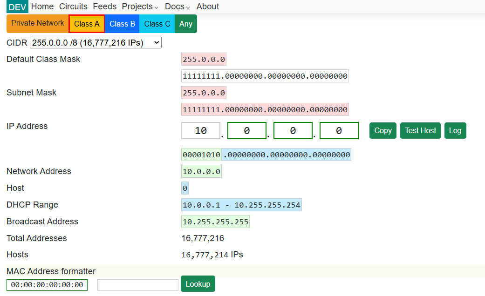

# TypeScript Network Library 2025

##

```

This's the code of my network library

```

Below is an image of my website [diogny.com/projects/network](https://diogny.com/projects/network) network page



Classes
---
- [Subnet](https://github.com/Diogny/netjs/blob/main/src/subnet.ts)
- [DHCP](https://github.com/Diogny/netjs/blob/main/src/dhcp.ts)
- [IP](https://github.com/Diogny/netjs/blob/main/src/ip.ts)
- [MAC](https://github.com/Diogny/netjs/blob/main/src/mac.ts)
- [CIDR](https://github.com/Diogny/netjs/blob/main/src/cidr.ts)
- [Subnet Mask](https://github.com/Diogny/netjs/blob/main/src/subnet-mask.ts)
- [Subnet Address](https://github.com/Diogny/netjs/blob/main/src/subnet-address.ts)
- [Network Class](https://github.com/Diogny/netjs/blob/main/src/network-class.ts)
- [Network Range](https://github.com/Diogny/netjs/blob/main/src/network-range.ts)